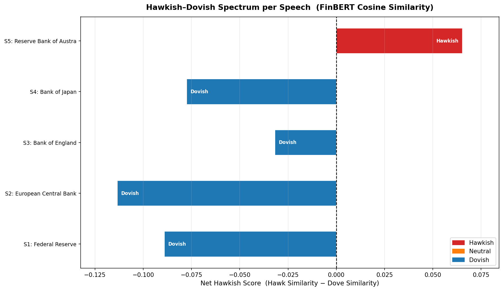
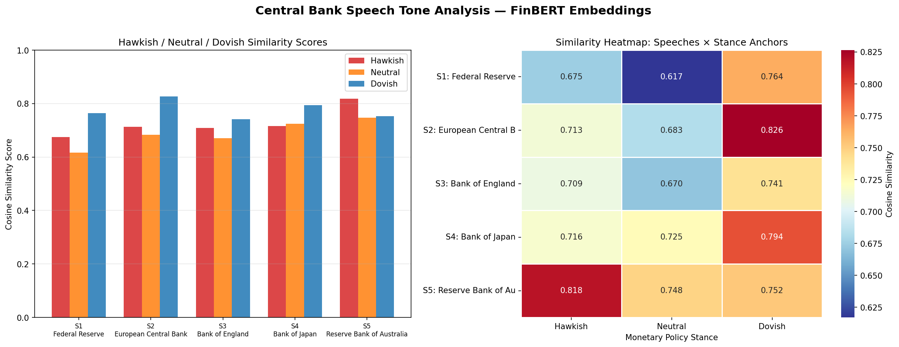
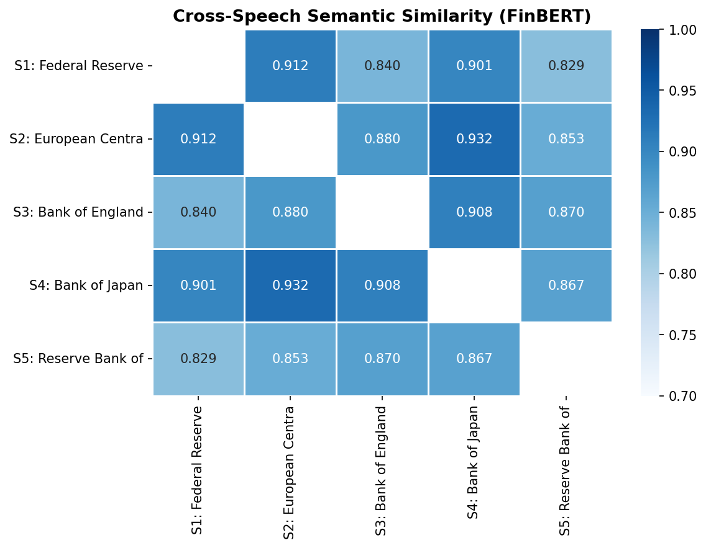

# 🏦 Central Bank Speech Tone Analyser
### Hawkish vs Dovish Classification using FinBERT Embeddings


A financial NLP pipeline that classifies the monetary policy tone of central bank speeches — **Hawkish 🦅, Neutral ⚖️, or Dovish 🕊️** — using zero-shot semantic similarity over FinBERT embeddings. No labelled training data required.

---
 
## 💡 Motivation
 
Central bank statements move markets, but they are lengthy, carefully worded documents that take significant time to interpret consistently across multiple institutions and meeting cycles. Portfolio managers and analysts need to quickly gauge not just what was decided, but the directional bias behind it — whether the language leans toward further tightening, a pause, or easing — since that distinction directly drives positioning across rates, FX, and equities.
 
This tool automates the first-pass triage. It produces an objective, reproducible tone classification in seconds, freeing up analyst attention for what follows: forming the macro view, sizing the risk, and adjusting the portfolio.
 

---

## 📊 Results

Five real central bank speeches from Q4 2025 – Q1 2026 were analysed across the Fed, ECB, BOE, BOJ, and RBA.

### Classification Summary

| Central Bank | Governor | Date | Tone | Confidence |
|---|---|---|---|---|
| Federal Reserve | Jerome Powell | 2026-01-28 | 🕊️ Dovish | 0.7639 |
| European Central Bank | Christine Lagarde | 2026-02-26 | 🕊️ Dovish | 0.8265 |
| Bank of England | Andrew Bailey | 2026-02-08 | 🕊️ Dovish | 0.7411 |
| Bank of Japan | Kazuo Ueda | 2025-12-25 | 🕊️ Dovish | 0.7939 |
| Reserve Bank of Australia | Michele Bullock | 2026-03-03 | 🦅 Hawkish | 0.8175 |

### Similarity Scores

| ID | Hawkish | Neutral | Dovish | Classification |
|----|---------|---------|--------|---------------|
| S1 — Fed | 0.6748 | 0.6170 | **0.7639** | 🕊️ Dovish |
| S2 — ECB | 0.7130 | 0.6831 | **0.8265** | 🕊️ Dovish |
| S3 — BOE | 0.7093 | 0.6703 | **0.7411** | 🕊️ Dovish |
| S4 — BOJ | 0.7164 | 0.7250 | **0.7939** | 🕊️ Dovish |
| S5 — RBA | **0.8175** | 0.7476 | 0.7522 | 🦅 Hawkish |

---

## 📈 Visualisations

### Hawkish–Dovish Spectrum
*Net directional bias per speech (Hawkish similarity − Dovish similarity). Left of zero = dovish; Right of zero = hawkish*



### Similarity Score Breakdown & Heatmap
*Left: grouped bar chart of raw similarity scores per stance. Right: full score matrix across all speeches.*



### Cross-Speech Semantic Similarity
*Pairwise cosine similarity between speeches. Higher values indicate more aligned communication style between two central banks.*

<p align="center">


---

## 🔍 Key Findings

- **Broad dovish consensus in early 2026** — Four of five major central banks lean dovish, consistent with the global rate-cutting cycle following the 2022–2023 tightening phase.
- **RBA is the clear outlier** — The Reserve Bank of Australia returned the highest hawkish confidence score (0.8175). Bullock's speech explicitly cited inflation above target and a unanimous Board decision to raise the cash rate — a direct contrast to peers.
- **ECB holds the strongest dovish signal** — Lagarde's February 2026 parliamentary hearing produced the highest dovish confidence (0.8265), consistent with CPI having fallen to 1.7% — below the 2% target.
- **BOE sits closest to neutral** — Bailey's AlUla speech was a macro commentary rather than a rate decision statement, which explains the smallest net dovish margin in the sample.
- **BOJ and ECB communicate most similarly** — The cross-speech heatmap shows an ECB–BOJ similarity of 0.932, the highest pair in the sample, despite the two banks being on divergent policy paths. This reflects shared institutional communication conventions rather than shared policy direction.

---

## 🧠 How It Works

The pipeline runs in three steps inside `finbert_central_bank_analysis.ipynb`:

**1. Embed** — Speech text and hand-crafted stance anchors are encoded into 768-dimensional vectors using `ProsusAI/finbert`, a BERT model pre-trained on financial communications. Embeddings are extracted via **mean pooling with attention masking**, which averages only over real (non-padding) tokens.

**2. Classify** — Cosine similarity is computed between each speech embedding and three anchor embeddings (Hawkish, Neutral, Dovish). The closest anchor wins — this is **zero-shot classification**, requiring no labelled training data.

**3. Summarise** — Key sentences are extracted by scoring each sentence against a curated list of monetary policy keywords (e.g. `"decided to"`, `"raise"`, `"cash rate"`, `"appropriate"`), returning the top 5 most signal-dense findings per speech.

---

## 🚀 Getting Started

### Install dependencies
```bash
pip install transformers torch scikit-learn matplotlib seaborn
```

### Run
```bash
jupyter notebook finbert_central_bank_analysis.ipynb
```

### Add speeches
Speeches are passed in as a list of dictionaries:

```python
speeches = [
    {
        "id"    : "S1",
        "source": "Federal Reserve (Jerome Powell)",
        "date"  : "2026-01-28",
        "event" : "FOMC Press Conference",
        "text"  : "Paste full speech excerpt here..."
    },
    # add more ...
]
```

---

## 🗺️ What Could be Done Better?

The current version uses static text inputs. The natural extension is to automate data ingestion so the pipeline runs continuously on new speeches as they are published.

### Option 1 — Web Scraping

Each major central bank publishes speeches on its own website. A scheduled scraping module using `requests` + `BeautifulSoup` or `playwright` could pull new transcripts automatically after each policy meeting:

```python
import requests
from bs4 import BeautifulSoup

def fetch_fed_speeches(url="https://www.federalreserve.gov/newsevents/speeches.htm"):
    soup = BeautifulSoup(requests.get(url).content, "html.parser")
    # parse speech links, dates, speaker names
    # format into speeches[] dict and pass to pipeline
    ...
```

| Central Bank | Speech Archive |
|---|---|
| Federal Reserve | federalreserve.gov/newsevents/speeches |
| European Central Bank | ecb.europa.eu/press/key |
| Bank of England | bankofengland.co.uk/news/speeches |
| Bank of Japan | boj.or.jp/en/announcements/press |
| Reserve Bank of Australia | rba.gov.au/speeches |

### Option 2 — Financial Data APIs

For a production-grade setup, data APIs provide structured, clean access to central bank text without scraping maintenance:

| API | What it provides |
|---|---|
| **Bloomberg API** | Full transcripts, press conference text, real-time policy feeds |
| **Refinitiv (LSEG) Eikon** | News wire, policy statements with rich metadata |
| **NewsAPI / GDELT** | Free-tier news aggregation for CB-related headlines |
| **BIS API** | Structured central bank speech data from the Bank for International Settlements |

A fully automated pipeline would look like:

```
API / Scraper  →  New speech detected
      ↓
Text extracted & formatted into speeches[] dict
      ↓
FinBERT embedding + cosine similarity classification
      ↓
Tone result appended to a time-series database
      ↓
Dashboard or alert system updated (e.g. flag on hawkish shift)
```

### Further Extensions

- **Time-series tone tracker** — run the pipeline on every speech per central bank over rolling quarters to visualise how policy bias evolves over time
- **Cross-asset backtesting** — map tone classifications to FX and rates data to test whether hawkish/dovish shifts carry predictive signal
- **LLM-generated summaries** — replace keyword extraction with a prompted language model for richer narrative-style findings
- **Multi-language support** — extend to ECB speeches in German/French using multilingual FinBERT variants

---

## ⚙️ Technical Notes

**Why FinBERT over general BERT?**
FinBERT is pre-trained on financial text — earnings calls, analyst reports, and market commentary. It natively understands terms like "accommodative", "basis points", and "tightening cycle" without fine-tuning, making it more reliable for central bank language than a general-purpose model.

**Why zero-shot classification?**
No labelled hawkish/dovish dataset is needed. Classification emerges purely from the geometric alignment between speech embeddings and anchor phrases in vector space, making the pipeline immediately applicable to new speakers, new central banks, or new policy regimes without retraining.

**Score compression:**
Because all speeches share the same financial domain, cosine similarity scores cluster in a narrow range (typically 0.65–0.85). This is expected behaviour in domain-specific embedding spaces. The **net score** (hawkish − dovish) is consequently a more informative signal than the raw scores alone.

---

## 📚 References

- Araci, D. (2019). [FinBERT: Financial Sentiment Analysis with Pre-trained Language Models](https://arxiv.org/abs/1908.10063)
- Devlin, J. et al. (2018). [BERT: Pre-training of Deep Bidirectional Transformers](https://arxiv.org/abs/1810.04805)
- [ProsusAI/finbert — HuggingFace Model Card](https://huggingface.co/ProsusAI/finbert)

---

*Built with ProsusAI/FinBERT · HuggingFace Transformers · PyTorch · scikit-learn*
